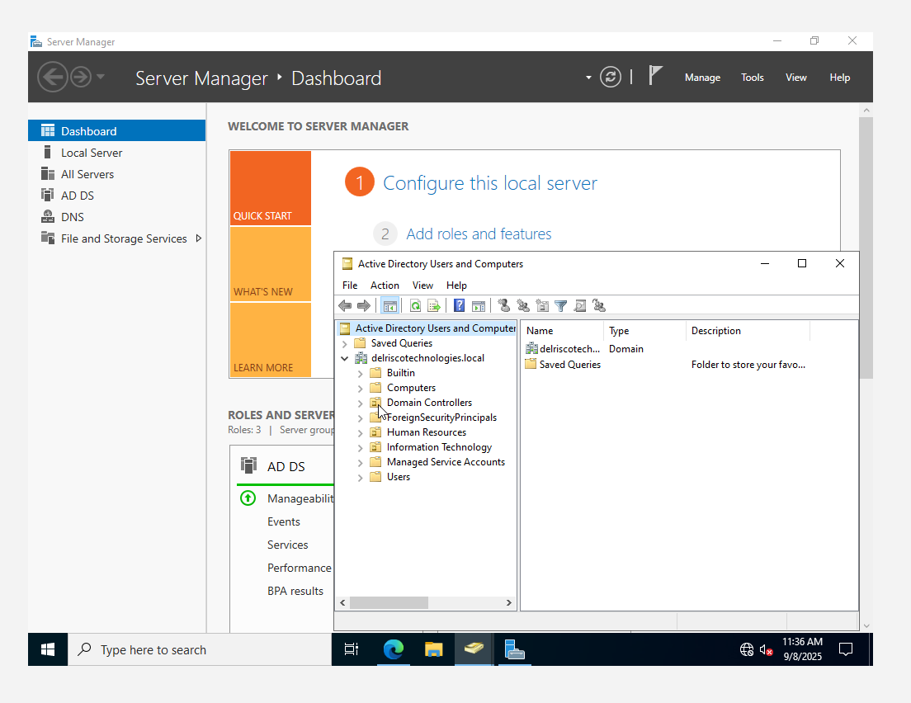

<h1 align="center">ACTIVE DIRECTORY HOME LAB</h1>

<p align="center">
  A four-VM detection lab for identity, endpoint telemetry, controlled attack simulation, and Splunk analysis.
</p>

<p align="center">
  <a href="#quick-start">Quick Start</a> ·
  <a href="#lab-architecture">Architecture</a> ·
  <a href="#what-you-detect">Detection</a> ·
  <a href="#scope-and-safeguards">Scope</a> ·
  <a href="SECURITY.md">Security</a>
</p>

---

This repository documents an isolated Active Directory environment built to make authentication, endpoint activity, attack simulation, and defensive analysis visible in one place.

The lab connects a Windows Server domain controller, a domain-joined Windows 10 endpoint, an Ubuntu Splunk server, and a Kali Linux attacker VM. Windows Event Logs and Sysmon telemetry flow into Splunk, where controlled activity can be searched and correlated without touching a production network.

[Read the complete illustrated walkthrough](index.html).

> Use this lab only on systems and networks you own or have explicit permission to test. Every address, account, hostname, and credential shown here belongs to an isolated training sandbox.

## Quick Start

The walkthrough is a static site with no build step. Clone the repository and serve it locally:

```bash
git clone https://github.com/delriscotechnologies/homelabactivedirectory.git
cd homelabactivedirectory
python -m http.server 8000
```

Open `http://localhost:8000` in a browser.

The page includes a small local reading-progress indicator. It performs no analytics, stores no data, and makes no network requests.

## Lab Architecture

| System | Platform | Lab address | Purpose |
| --- | --- | --- | --- |
| Splunk server | Ubuntu Server 22.04 | `192.168.64.10` | Receives, searches, and visualizes security telemetry |
| Domain controller | Windows Server | `192.168.64.7` | Hosts AD DS, DNS, users, OUs, policies, and auditing |
| User endpoint | Windows 10 | `192.168.64.100` | Joins the domain and forwards Windows and Sysmon events |
| Attacker VM | Kali Linux | `192.168.64.250` | Generates authorized authentication activity for detection testing |

Domain-joined systems use the domain controller for Active Directory DNS. External lookups are forwarded upstream by the domain controller instead of bypassing the AD-aware resolver.

<p align="center">
  
</p>

## How the Lab Works

1. The domain controller provides identity, policy, DNS, and security auditing for `delriscotechnologies.local`.
2. The Windows endpoint generates native event logs and enriched Sysmon process and network telemetry.
3. Splunk Universal Forwarder sends approved telemetry to the Splunk server over a restricted, TLS-protected ingestion path.
4. The Kali VM generates controlled Hydra authentication attempts inside the lab.
5. Splunk searches correlate failed logons, processes, users, computers, and source addresses.

This repository documents the environment; it does not automate VM provisioning or include real credentials, certificates, or production data.

## What You Detect

The walkthrough focuses on evidence that is useful during an investigation:

- repeated Windows authentication failures
- source-address and account patterns
- process creation recorded by Sysmon
- endpoint and domain-controller activity in one search surface
- the relationship between simulated attacker actions and defender-visible events

Failed-logon aggregation:

```spl
index=wineventlog EventCode=4625
| stats count by Account_Name, src_ip
```

Process-creation aggregation:

```spl
index=sysmon EventCode=1
| stats count by Image, User, Computer
```

The exact field names and index layout depend on the local Splunk inputs and add-ons. Verify them against the events in your own authorized lab before building alerts.

## Repository Layout

| Path | Purpose |
| --- | --- |
| `index.html` | Complete illustrated lab write-up |
| `reading-progress.js` | Accessible, dependency-free reading indicator |
| `images/` | Active Directory, Windows, Ubuntu, Kali, and Splunk screenshots |
| `SECURITY.md` | Private reporting and lab-data handling guidance |
| `.github/workflows/html.yml` | Automated HTML validation |

## Scope and Safeguards

- Keep the domain controller, Splunk server, endpoint, and attacker VM on an isolated lab network.
- Never reuse the sample accounts, passwords, addresses, or forest name on personal or production systems.
- Do not expose RDP, Splunk management, forwarder ingestion, or Active Directory services directly to the internet.
- Run Hydra only against systems you own or are explicitly authorized to test.
- Use a dedicated non-production account for simulations and remove any real secrets before capturing screenshots.
- Restrict Splunk ingestion to approved forwarders and validate TLS certificates.
- Treat exported events and screenshots as sensitive if they contain internal names or identifiers.

See [SECURITY.md](SECURITY.md) for reporting and handling guidance.
